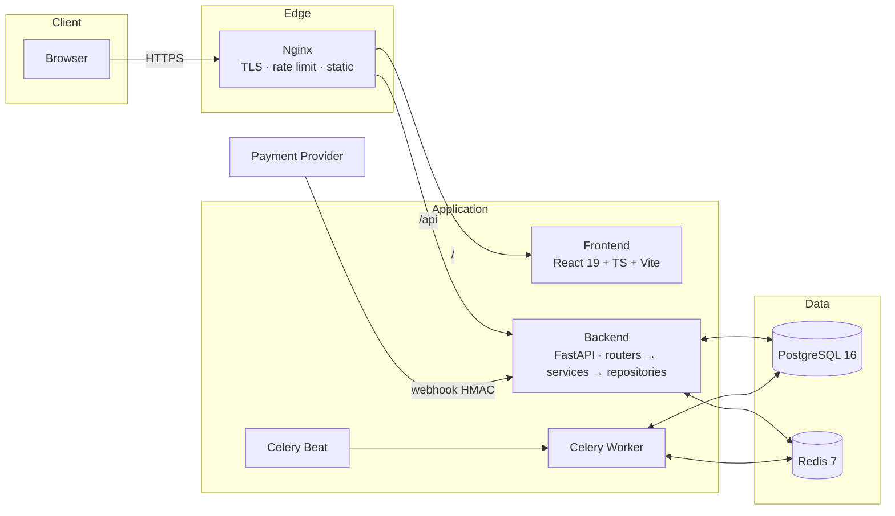
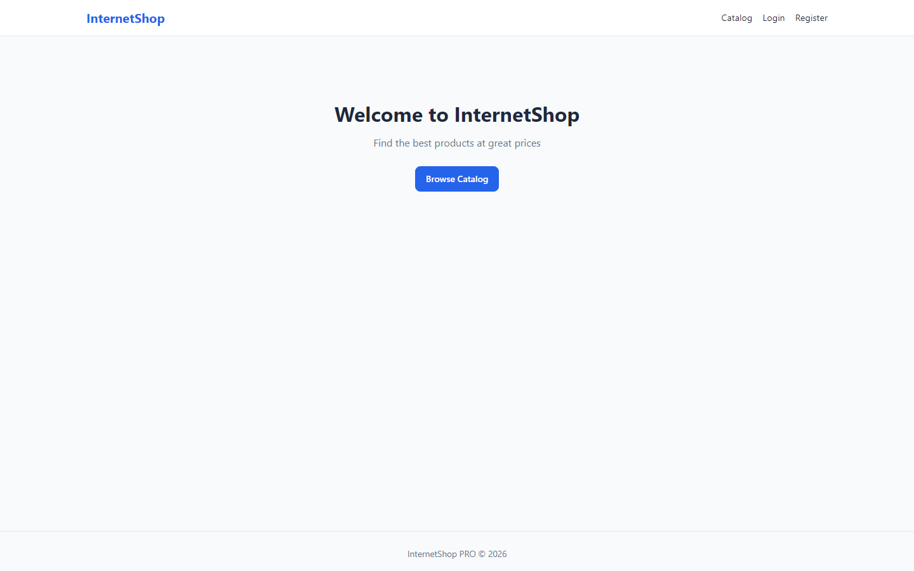
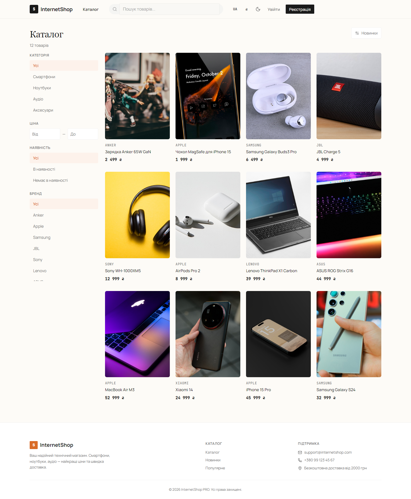
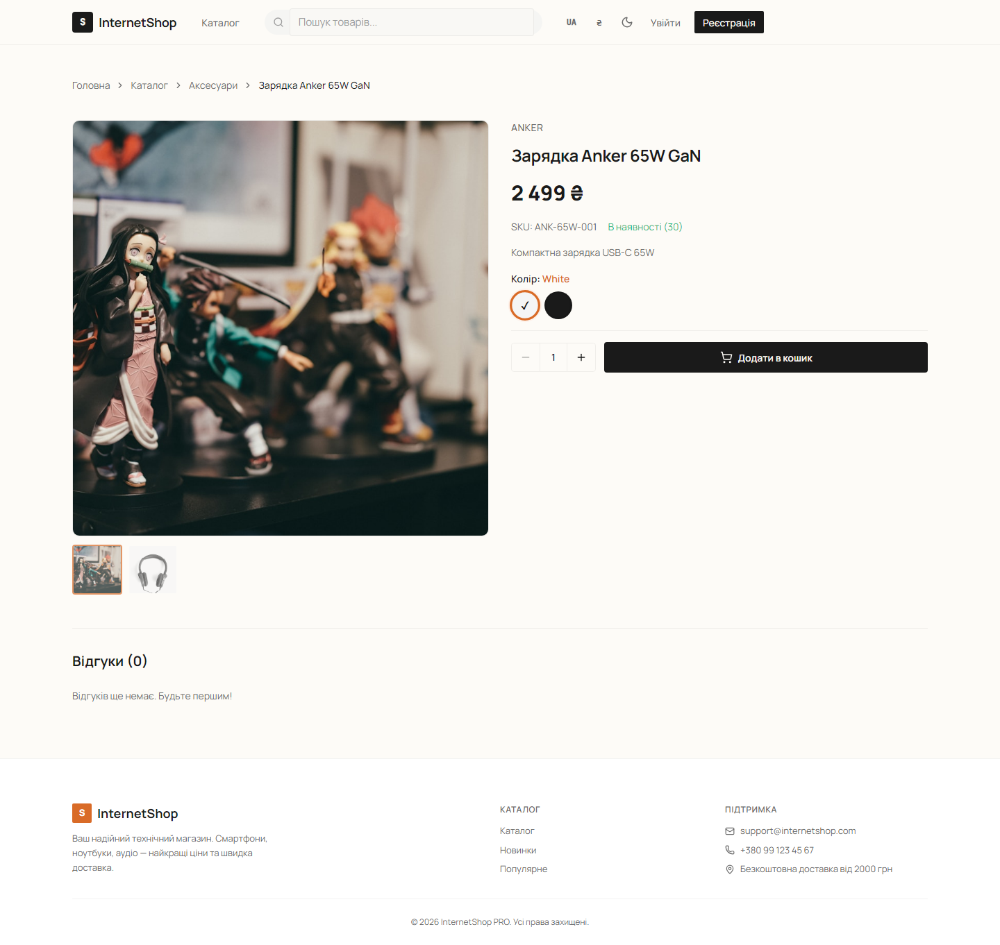
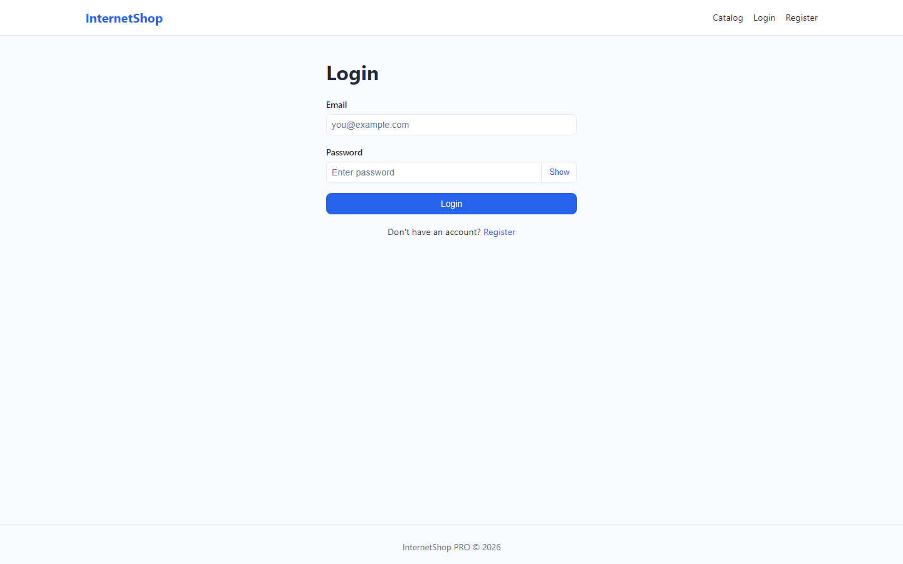

# Internet Shop PRO

Full-stack e-commerce platform: FastAPI + PostgreSQL + Redis + Celery on the backend, React 19 + TypeScript on the frontend, fully dockerized with CI/CD and production deploy tooling.

> Built as a production-grade learning project — 76 structured lessons from architecture to final release.


## Features

**Storefront**
- Catalog: categories / subcategories, products, images, variants (e.g. iPhone Black 128GB / White 256GB)
- Search by name, SKU and description using PostgreSQL `ILIKE`, filters (category, price, stock, brand), sorting & pagination
- Cart with stock validation, race-condition-safe checkout (row locking)
- Orders with full lifecycle: `pending → paid → processing → shipped → completed / cancelled`
- Payments: provider integration, webhooks with HMAC signature verification, idempotency
- Favorites, reviews & moderation. Review policy: any registered user may post a
  review; purchases are detected automatically and shown as a **Verified Purchase** badge
- Promo codes (percentage / fixed, expiry, usage limits, min order amount)
- Delivery methods & shipping cost calculation

**Accounts & Security**
- JWT auth: access + refresh tokens, `jti`, refresh-token blacklist (in-process, single instance; Redis-backed — у плані v1.1.0), token-type validation, refresh rotation with reuse detection
- RBAC: user / manager / admin
- Rate limiting (login 5/min, register 3/min, password change 3/5min, 100/min default)
- Security headers (CSP, HSTS), CORS allow-list
- OWASP basics covered: SQL injection, XSS, CSRF, IDOR
- Payment webhooks fail-closed in production without a configured secret

**Admin panel**
- Dashboard with statistics (sales, revenue, popular products)
- Product / category / user / order management, promo codes

**Infrastructure**
- Redis caching with TTL (`cache_get/set/delete/delete_pattern`)
- Background tasks + Celery worker & beat (notification cleanup, expired promos, daily stats)
- Structured logging, logrotate, journald, full health checks
- Nginx reverse proxy: rate limiting, least_conn upstream, OCSP, security hardening
- GitHub Actions CI/CD: tests → lint → build → auto-deploy + Telegram notify + Dependabot

## Architecture



Backend layering:

```
backend/app/
├── models/         # SQLAlchemy models
├── schemas/        # Pydantic schemas
├── routers/        # HTTP layer
├── services/       # business logic
├── repositories/   # DB access
└── utils/          # security, tokens, etc.
```

## Tech Stack

| Layer | Technologies |
|---|---|
| Backend | Python 3.12+, FastAPI, SQLAlchemy (async), Alembic, Pydantic |
| Database | PostgreSQL 16, Redis 7 |
| Async jobs | Celery (worker + beat) |
| Frontend | React 19, TypeScript, Vite, React Router 7, Axios |
| Testing | Pytest (1087 tests), Vitest + Testing Library (82 tests) |
| DevOps | Docker Compose, Nginx, GitHub Actions, bash deploy scripts |

## Quick Start (Docker)

```bash
git clone https://github.com/<your-username>/InternetShop_PRO.git
cd InternetShop_PRO

# .env.docker already contains local dev defaults — customize if needed
docker compose up --build
```

Services after startup:

| Service | URL |
|---|---|
| Frontend | http://localhost:3000 |
| API | http://localhost:8000/api |
| Swagger UI | http://localhost:8000/docs |
| ReDoc | http://localhost:8000/redoc |

## Local Development (without Docker)

**Backend**

```bash
cd backend
python -m venv .venv
source .venv/bin/activate        # Windows: .venv\Scripts\activate
pip install -r requirements.txt
cp .env.example .env             # set DATABASE_URL, SECRET_KEY, REDIS_URL
alembic upgrade head
uvicorn app.main:app --reload
```

Requires running PostgreSQL and Redis (or use only the compose db/redis services).

**Frontend**

```bash
cd frontend
npm install
cp .env.example .env             # VITE_API_URL=http://localhost:8000
npm run dev
```

## Production Deploy

1. Copy `deploy/.env.prod.example` → `.env.docker` and fill real values
   (generate `SECRET_KEY`: `python -c "import secrets; print(secrets.token_hex(32))"`)
2. Provision the server with `deploy/server-setup.sh`, `deploy/firewall.sh`, `deploy/ssh-setup.sh`
3. Set up TLS: `deploy/ssl-setup.sh` (Let's Encrypt / OCSP)
4. Deploy: `deploy/deploy-backend.sh` + `deploy/deploy-frontend.sh`
5. Verify: `deploy/health-check-full.sh`

CI/CD via GitHub Actions runs tests → lint → build → deploy on push (see `.github/workflows/`).

## API Documentation

Interactive docs are generated by OpenAPI:

- **Swagger UI:** `/docs`
- **ReDoc:** `/redoc`
- **OpenAPI schema:** `/openapi.json`

Main resource groups: `auth`, `profile`, `categories`, `products`, `product-images`,
`product-variants`, `cart`, `orders`, `payments`, `favorites`, `reviews`, `promo`,
`notifications`, `admin`.

Example — register & login:

```bash
curl -X POST http://localhost:8000/api/auth/register \
  -H "Content-Type: application/json" \
  -d '{"email":"user@example.com","username":"user","password":"Str0ngPass!"}'

curl -X POST http://localhost:8000/api/auth/login \
  -H "Content-Type: application/json" \
  -d '{"email":"user@example.com","password":"Str0ngPass!"}'
```

## Testing

```bash
# backend (requires test PostgreSQL/Redis per backend/.env)
cd backend && pytest

# frontend
cd frontend && npm test
```

Current status: **1087 backend + 82 frontend tests passing.**

## Screenshots

| Home | Catalog |
|---|---|
|  |  |

| Product | Login |
|---|---|
|  |  |

## Project Status

- [x] Lessons 1–74: architecture, catalog, cart, orders, payments, admin, frontend, Redis/Celery, testing, security, Docker, deploy, performance, logging, CI/CD
- [x] Lesson 75: full manual QA pass + bugfix round (promo checkout, webhook hardening, verified reviews) + final documentation
- [x] Lesson 76: release v1.0.0

## License

MIT
